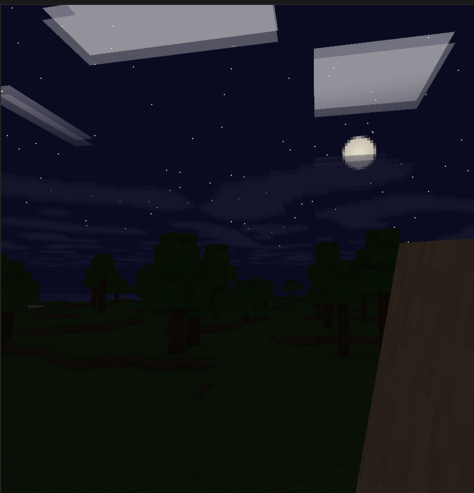

# Minecraft Clone in C++/OpenGL

A Minecraft-like voxel sandbox built with C++ and OpenGL 3.3 Core Profile. Procedural terrain, biomes, cellular-automaton water, primed TNT with entity physics, cross-texture plants, day/night cycle, multithreaded chunk streaming, persistent saves, and a WebAssembly build.

## Screenshots

### v0.7

https://github.com/user-attachments/assets/4a94017a-34d2-41fa-8707-44ceb98dd80f

<details>
<summary><b>Earlier versions</b></summary>

#### v0.6


#### v0.5

https://github.com/user-attachments/assets/c95a33fa-b7e2-41ac-b8ba-79bb7edf997f

#### v0.4



#### v0.3


#### v0.2

[](https://i.imgur.com/WYfonMc.mp4)

#### v0.1

<p>
  
  
  
  
</p>

</details>

## Features

### World
- Procedural terrain with multi-octave Perlin noise - continentalness, temperature, humidity
- 6 biomes - ocean, beach, plains, forest, desert, tundra - driving surface blocks, tree/cactus placement, snow caps and shore sand/gravel post-pass
- 18 block types including `GRASS`, `DIRT`, `STONE`, `COAL_ORE`, `BEDROCK`, `WATER`, `SAND`, `GLOWSTONE`, `WOOD`, `LEAVES`, `SNOW`, `GRAVEL`, `CACTUS`, `TNT`, and cross-quad plants (`TALL_GRASS`, `DANDELION`, `POPPY`)
- Unified vegetation placement - trees, cacti, and plants share a `claimed[]` occupancy grid so nothing grows under a canopy or clips with another tree
- Persistent worlds - modified chunks save as palette-encoded binary files in `saves/world/chunks/`; player position, yaw/pitch, hotbar, selected slot, and walk mode in `level.dat`

### Simulation
- Cellular-automaton water at 4 ticks/sec (FPS-agnostic, wall-clock timed) - gravity, horizontal spread, infinite source cloning, falling decay; sloped surfaces with corner-averaged heights across diagonal chunks
- Flowing water pushes the player horizontally along the flow gradient; waterfalls push vertically down
- Swim physics (asymmetric vertical drag), underwater ambience, enter/exit splashes, bubble emission
- Primed TNT as a separate entity (not a block): 4 s fuse default, 10–30 tick random fuse for chain reactions, gravity + voxel collision, visual flashing, 40-particle white smoke plume on detonation, 4 rotating explosion sound samples, isotropic camera shake

### Rendering
- Two-pass mesh build: opaque chunks front-to-back for early-Z, then water back-to-front with blending
- Per-chunk batched VAO/VBO with packed vertex formats - `PackedVertex` (12 B) for opaque, `WaterVertex` (20 B, 4-byte aligned for WebGL) for fluids
- Section-level incremental remesh via an 8-bit `sectionDirty` bitmask
- Sky light flood-fill + block light (glowstone = 15) with cross-chunk propagation; sparse per-section storage (~8 KB/chunk vs a flat 32 KB)
- Per-vertex AO with branchless face-brightness multiplier; runtime-toggleable greedy meshing (off by default - AO artifacts)
- Frustum culling (AABB per chunk), distance fog ramping to sky color or blue underwater fog
- Directional sun with day/night cycle, bloom halos on sun + moon billboards, stars at night, volumetric-raymarched clouds
- Cross-texture plants with leaf-sway shader (tall grass tips bob in wind, stem stays anchored)
- Lazy-init particle system for explosion smoke plumes (pool of 512 billboards)

### Audio
- Miniaudio single-header engine for all playback
- Per-biome step / break sounds (grass, stone, sand, gravel, snow, wood, water, cloth)
- Underwater ambience + enter/exit/bubble sounds
- Water-flow ambient loop proximity-faded
- 4 explosion WAV samples picked at random per TNT detonation; TNT click-ignition via flint-and-steel UX (right-click a TNT block)

### UX
- Main menu, settings, pause menu with dirt background + embedded 8×8 bitmap font (no external font file)
- Inventory grid (press **E**) - click to assign a block to the current hotbar slot
- Settings persist to `settings.txt`: render distance, FOV, VSync, mouse sensitivity, daylight cycle, greedy meshing toggle
- Grass-block icon embedded in the `.exe` (Windows taskbar + title bar) + runtime `glfwSetWindowIcon` fallback
- Window title live stats: `FPS | frame time ms | chunks rendered/loaded`

### Platform
- Desktop: Linux / Windows (native or MinGW cross-compile from Linux)
- WebAssembly build via Emscripten (WebGL 2.0 / OpenGL ES 3.0)
- Async chunk generation + mesh builds on worker threads (native); single-threaded synchronous path on web
- Frame profiler with GPU timer queries, per-phase breakdown (update / render / swap), memory attribution, and optional Tracy client integration

## Requirements

- C++20, CMake 3.25+
- OpenGL 3.3+, GLFW 3.3+, GLM, stb_image (header-only), GLAD

Debian / Ubuntu:
```bash
sudo apt-get install libglfw3-dev libgl1-mesa-dev
```

Optional: [Emscripten SDK](https://emscripten.org/) for the web build; `mingw-w64` for Windows cross-compile from Linux.

## Build

### Desktop

```bash
cmake -B build -DCMAKE_BUILD_TYPE=Release
make -C build -j$(nproc)
./build/minecraft                 # run from project root - asset paths are relative
./build/minecraft --seed 42       # specific world seed
```

### Windows (MinGW cross-compile from Linux)

```bash
cmake -B build_win -DCMAKE_TOOLCHAIN_FILE=mingw-toolchain.cmake -DCMAKE_BUILD_TYPE=Release
make -C build_win -j$(nproc)
# build_win/minecraft.exe - ships with embedded grass-block icon
```

### Web (WebAssembly)

```bash
./build_web.sh
python3 -m http.server -d build_web 8080     # then open http://localhost:8080/minecraft.html
```

Shaders are patched at runtime from `#version 330 core` to `#version 300 es`. WASM `INITIAL_MEMORY=256MB` with `ALLOW_MEMORY_GROWTH=1`. Assets are bundled via `--preload-file`.

### CMake options

```
-DENABLE_CLANG_TIDY=OFF           # disable the clang-tidy pass (faster builds)
-DWARNINGS_AS_ERRORS=OFF          # allow warnings through (on by default)
-DBUILD_TESTS=OFF                 # skip the test target
-DBUILD_WITH_TRACY=ON             # link the Tracy profiler client (listens on 127.0.0.1:8086)
```

## Tests

GoogleTest-based, 165 tests across 23 suites - no OpenGL needed. Covers terrain heights & biomes, coordinate helpers, block properties, palette-encoded chunk sections, sparse sky light, world resolver, water simulator, the offline mesh builder, world save/load, inventory, collision, block placement, and TNT entity physics.

```bash
make -C build tests && ./build/tests
./build/tests --gtest_filter='ChunkMesh.*'   # single suite
./build/tests --gtest_filter='TntEntityTest.*'
```

## Controls

| Key | Action |
|---|---|
| **WASD** | Move |
| **Space** | Jump / fly up (double-tap toggles walk ↔ fly) |
| **Shift** / **Q** | Fly down |
| **R** (always), **Shift / Ctrl** in walk | Sprint |
| **Left Click** | Break block |
| **Right Click** | Place block - or ignite if aimed at TNT |
| **1 – 0** | Select hotbar slot |
| **Scroll** | Cycle hotbar |
| **E** | Toggle inventory |
| **X** | Wireframe (desktop only) |
| **F12** | Fullscreen (desktop only) |
| **Esc** / **Tab** (web) | Pause menu |

## Project Structure

```
src/          - C++ source files (camera, chunk, chunk_mesh, world, ChunkManager,
                TerrainGenerator, WaterSimulator, tnt_entity, entity_manager,
                entity_cube_renderer, particle_system, player, menu, ui_renderer,
                world_save, inventory, ...)
include/      - public headers (mesh_types, chunk_mesh, world_resolver, ...)
assets/       - Shaders/, Textures/, Sounds/ (block textures, step/dig/explosion
                WAVs, music, tnt sound pack)
scripts/      - lint, release, build tools + standalone mapgen / check_biomes
tests/        - GoogleTest unit tests + header stubs for GL-free testing
cmake/        - MinGW cross-toolchain file
web/          - Emscripten shell template, favicon
docs/         - README media (thumbnails)
Libraries/    - vendored third-party (GLM, GLAD, stb, miniaudio, GLFW headers)
```

## Benchmarking

```bash
./benchmark.sh "label"                # windowed benchmark
./benchmark.sh "label" --headless     # headless (avoids WSL2 swap overhead)
```

Runs 600 warmup frames (camera spins 360° to stream chunks) then 600 measured frames (sprint forward). Writes per-run CSV history to `benchmark_history/` and compares against the previous run. Output includes frame-time percentiles, GPU timer, memory breakdown, and mesh-build stats. Git tags mark significant performance milestones.

<details>
<summary><b>Performance engineering techniques used</b></summary>

A summary of the non-trivial perf work in this engine - written out since this repo doubles as a portfolio piece. Everything listed is in tree; grep'able entry points are in parentheses.

### Rendering / GPU

- **Batched chunk meshes** - one VAO/VBO/EBO per 16×16×128 chunk, one `glDrawElements` call per chunk for opaque + one for water. At render distance 16 that's ~200 draws for 300k opaque triangles. (`Chunk::render`)
- **Packed vertex formats** - `PackedVertex` (12 B: int16 pos + 6× uint8 attributes) and `WaterVertex` (20 B with float32 pos for sub-block water heights, padded to 4-byte alignment for WebGL). Half the bandwidth of a naive `vec3 pos + vec3 normal` layout. (`include/mesh_types.h`)
- **Section-level incremental remesh** - each chunk tracks an 8-bit `sectionDirty` bitmask. Editing a block only rebuilds the 16-block section containing it + neighbors at section boundaries, not the whole 128-high column. (`Chunk::buildMeshData`)
- **Frustum culling + front-to-back sort** - AABB test per chunk with the Gribb-Hartmann plane extraction, sorted by squared distance for early-Z rejection on the opaque pass; water reversed for back-to-front blending. (`World::render`)
- **Single texture array** - all block textures packed into one `GL_TEXTURE_2D_ARRAY` keyed by integer layer, cached in the vertex. Zero texture-binding changes per frame. (`TextureArray`)
- **Shader uniform cache** - `Shader` class caches `glGetUniformLocation` results by name hash; uniform lookups are free after the first call. (`shader.h`)
- **Split plant draw pass** - plant indices live in the same EBO as cube faces but after a boundary offset. Chunks are drawn in two `glDrawElements` calls: cube faces with `GL_CULL_FACE` on, then plants with culling disabled so each quad shows both sides from 6 indices instead of 12. Halves plant index memory at the cost of one state change per chunk. (`Chunk::render`, `emitPlane`)
- **Branchless shading** - face brightness, AO multiplier, leaf cutout and water tint computed via `step()`/`mix()` chains instead of conditionals so the GPU doesn't serialize warps. (`frag.shd`)
- **Runtime-toggleable greedy meshing** - adjacent faces merged into larger quads when the user opts in; off by default because per-vertex AO interpolation across merged faces produces dark streaks.

### Memory / Data structures

- **Palette-encoded chunk sections** - each 16³ section stores a palette of unique block types + a bit-packed index array sized to the palette (`bitsPerBlock` = 1, 2, 4, 8 as needed). Same representation Minecraft 1.13+ uses. Typical overworld chunk: 1–4 KB/section vs 4 KB flat. (`ChunkSection`)
- **Sparse sky-light storage** - chunks with a fully sky-lit column don't allocate the 32 KB flat `skyLight[]`; a `SparseSkyLight` wrapper stores only the modified cells. ~22 MB savings at render distance 16 on open terrain. (`sparse_skylight.h`)
- **Lazy water-level allocation** - the 32 KB per-block `waterLevels[]` array is only allocated when a chunk actually contains water, so ocean chunks pay the cost once but land chunks pay nothing. (`Chunk`)
- **Stale `pendingMesh` eviction** - async mesh builds for chunks that fall out of view would otherwise leak the full `MeshData` forever. `ChunkManager::update` flushes any pending upload that hasn't been rendered for 20 frames, capped at 16 uploads per frame to avoid stalls.
- **`ChunkManager` box early-out** - `loadChunks` / `unloadChunks` both scan the 33×33 = 1089-cell render box. If the player hasn't crossed a chunk boundary since last frame the entire scan is skipped, cutting worst-case frame time by ~37% (4.1 ms → 2.6 ms p99 max in sprint benchmarks).

### Concurrency / Threading

- **Worker-thread chunk generation** - `ChunkManager` runs a pool of worker threads that consume a request queue. Workers run `generateChunkData` (terrain noise, biome pass, vegetation, compression into `ChunkSection`s) without touching GL, then hand results back through a result queue. Main thread integrates ready chunks each frame, bounded by `MAX_INTEGRATE_PER_FRAME`.
- **Worker-thread mesh builds** - same pool handles `buildMeshFromData` from snapshotted `NeighborBorders`. The offline mesh builder (`chunk_mesh.cpp`) is GL-free and shares code paths with the online rebuilder, verified equivalent by 13 `ChunkMesh.*` unit tests.
- **Cache-coherent snapshots** - instead of locking neighbor chunks during async builds, the main thread snapshots cardinal-edge + diagonal-corner data into a `NeighborBorders` POD that the worker consumes lock-free.

### Simulation

- **FPS-agnostic water ticks** - `WaterSimulator::tick()` is called every frame but early-exits via `std::chrono::steady_clock` unless 0.25 s have elapsed (4 ticks/sec). Identical behavior at 30 fps and 3000 fps.
- **20 TPS entity accumulator** - `EntityManager::tick(dt)` drives primed-TNT fuses at a fixed 20 ticks/sec via a wall-clock accumulator, capped at 0.5 s of catch-up so a long pause can't trigger hundreds of ticks at once.
- **Water-sim scratch reuse** - per-tick `activeBlocks`, `nextActive`, `tickCells` scratch containers are `.clear()`-ed rather than freed so the backing allocation survives across ticks. Pre-pass also pre-computes `chunk*` + local coords per active cell so the main pass skips redundant hash lookups.

### Tooling / profiling

- **Frame profiler** - per-phase timing (update / render / swap), GPU timer via `ARB_timer_query`, percentile breakdowns (p50/p95/p99/max), per-run CSV to `benchmark_history/` with auto-compare against the previous run. (`src/profiler.h`, `benchmark.sh`)
- **Optional Tracy client** - builds with `-DBUILD_WITH_TRACY=ON`, listens on `127.0.0.1:8086`. Plots memory attribution (`chunks.loaded`, `mem.sections_bytes`, `mem.skylight_bytes`, `process.rss_bytes`).
- **Memory attribution** - `Chunk::memoryBreakdown()` returns per-component bytes; `ChunkManager::totalChunkBreakdown()` aggregates; `sampleProcessRss()` queries OS-level working set (Win32 `GetProcessMemoryInfo` / Linux `/proc/self/status`).
- **Headless benchmark mode** - `--headless` renders to an offscreen FBO instead of the swapchain to avoid WSL2's abnormally slow GPU swap path. Separate code path that still runs all the chunk / mesh / water logic.
- **Performance history git tags** - `v1.0-baseline` and subsequent release tags mark perf milestones. `./benchmark.sh` auto-compares against the previous run.

### Build / platform

- **Two mesh-builder entry points, one implementation** - `chunk_mesh.cpp` is GL-free and linked into both the main game and the test binary, which is what lets 165 tests run without an OpenGL context.
- **WebAssembly build** - the same C++20 source compiles through Emscripten to WebGL 2.0. Shaders are patched at runtime from `#version 330 core` to `#version 300 es` so both targets share one shader file.
- **MinGW cross-compile from Linux** - `mingw-toolchain.cmake` lets you build `minecraft.exe` without booting Windows. A `--start-group` / `--end-group` linker wrap resolves the libstdc++ ↔ winpthread cycle that mingw-w64 otherwise chokes on.
- **Warnings-as-errors + clang-tidy by default** - catches whole classes of bugs at compile time; disabled per-file only when third-party headers (glad, miniaudio) misbehave.
- **`-O3 -march=native`** on desktop Release; `-Wno-stringop-overflow` only on mingw where GCC 10 fires a provable false-positive on `std::unique_ptr` moves.

</details>

## Potential Performance Optimizations

### Greedy Meshing with Shader-Based Lighting

Greedy meshing is a runtime toggle (`Settings → Greedy Meshing`, off by default). Merging adjacent faces into larger quads drops triangle count dramatically but causes AO and sky-light interpolation artifacts - dark streaks appear diagonally across merged faces where corner values differ. Minecraft itself avoids greedy meshing for the same reason.

A potential fix: compute AO and sky light **per-pixel in the fragment shader** instead of per-vertex interpolation:

1. **Fragment-based AO**: use `fract(FragPos)` to determine the pixel's position within the block and snap to the nearest corner's AO value, avoiding cross-block interpolation.
2. **3D light texture**: upload per-block sky light and AO as a 16×128×16 3D texture per chunk. The fragment shader samples it at `FragPos`, giving pixel-perfect lighting with zero interpolation artifacts.

Either would allow re-enabling greedy meshing (~12× fewer triangles) while keeping correct lighting. The tradeoff is shader complexity and texture bandwidth.

### VBO Consolidation

Each chunk currently owns its own VAO/VBO/EBO - at render distance 16 that's ~4 KB of buffers but real driver overhead ~10–20 KB per buffer. Pooling chunks into a handful of large VBOs with per-chunk slot offsets would cut ~50 MB of driver bookkeeping at the cost of a bump/free-list allocator. WebGL 2.0 can't use persistent-mapped buffers, so updates must go through `glBufferSubData`.

## License

[MIT](https://choosealicense.com/licenses/mit/)

## Authors

- [Scott TALLEC](https://github.com/TALLEC-Scott)
- [Justin JAECKER](https://github.com/Justinj68)
