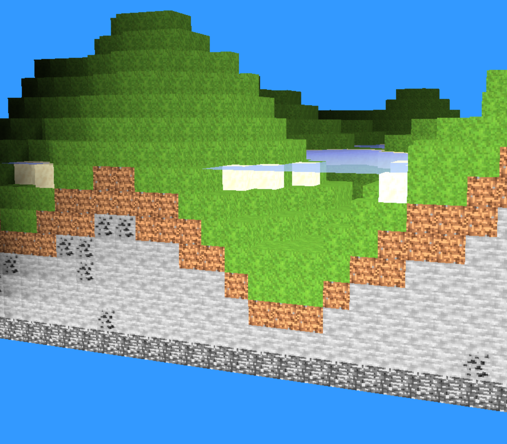
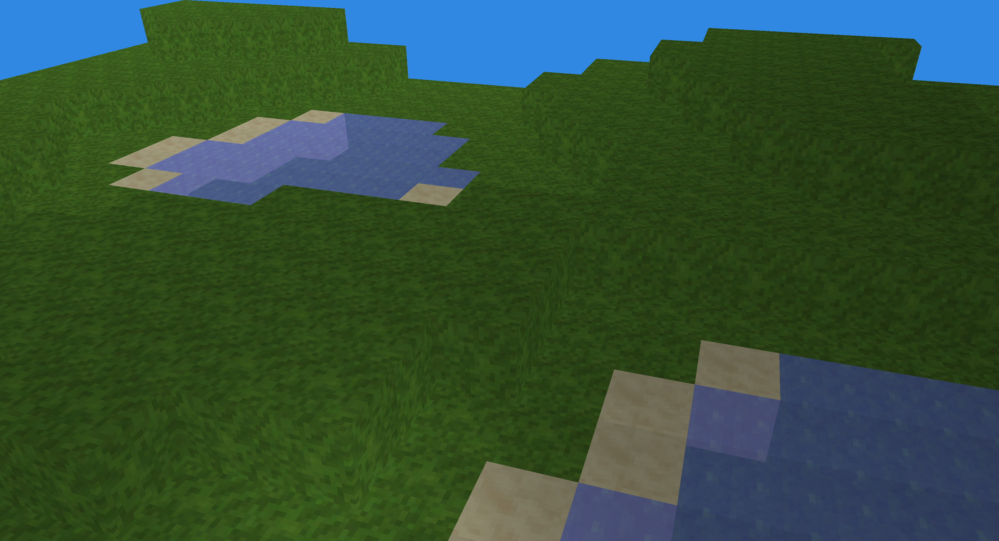
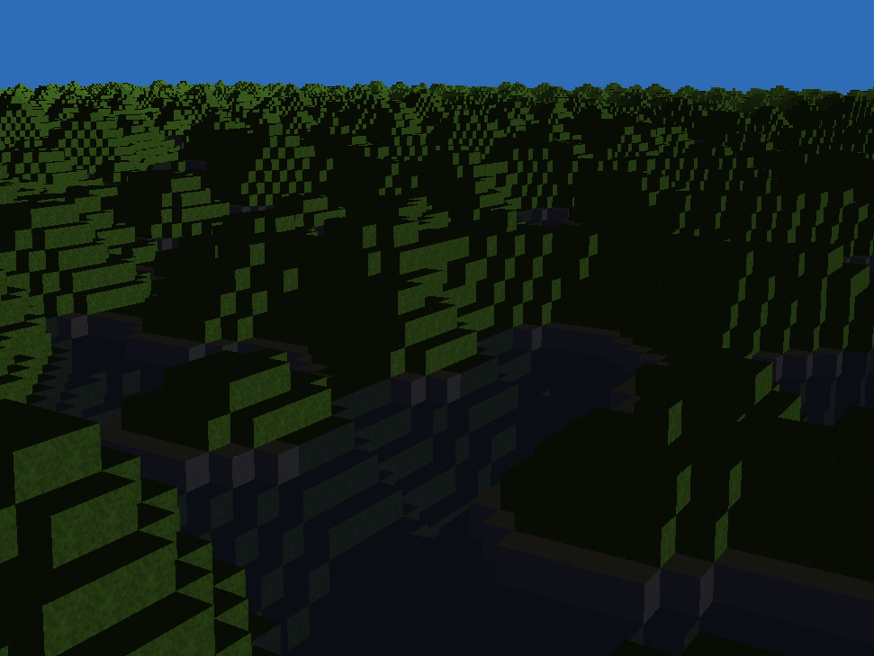
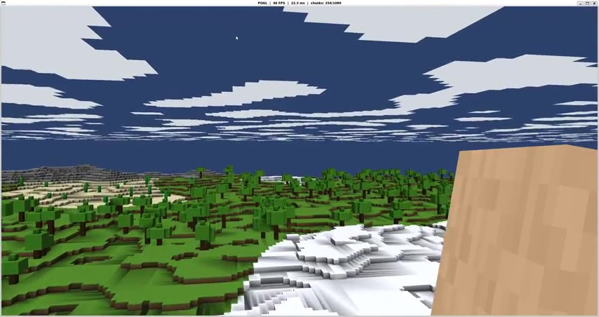
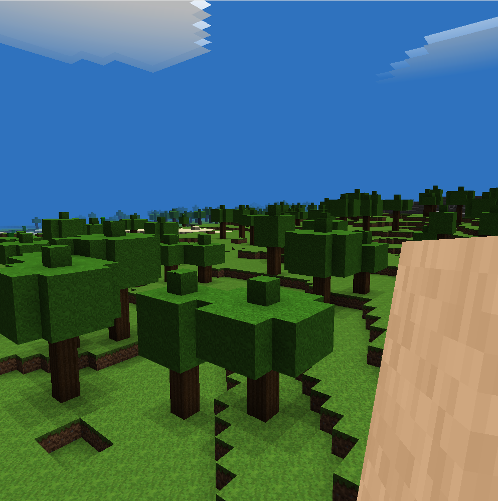
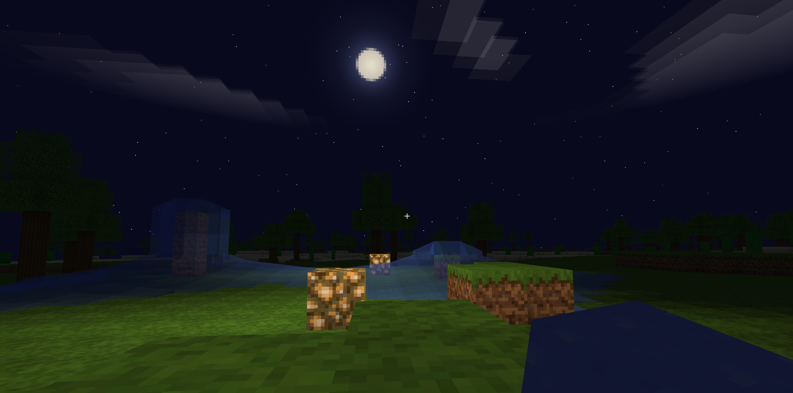

# Minecraft Clone in C++/OpenGL

A Minecraft-like voxel terrain renderer built with C++ and OpenGL 3.3 Core Profile.

## Screenshots


### v0.1




### v0.2

[](https://i.imgur.com/WYfonMc.mp4)

### v0.3



### v0.4
https://github.com/user-attachments/assets/b1350ee2-8fe9-47be-8e3b-8c2acb02ed27


### v0.5

https://github.com/user-attachments/assets/c95a33fa-b7e2-41ac-b8ba-79bb7edf997f

### v0.6



### v0.7

https://github.com/user-attachments/assets/4a94017a-34d2-41fa-8707-44ceb98dd80f

## Features

- Procedural terrain with multi-octave Perlin noise — continentalness, temperature, humidity
- Biome system: ocean, beach, plains, forest, desert, tundra (trees, cacti, snow caps, ores)
- Block editing: break (left-click) and place (right-click) with 10-slot hotbar, scroll to cycle
- Cellular-automaton water simulation at 4 ticks/sec (FPS-agnostic) — gravity, horizontal spread, infinite source, sloped surfaces with directional flow animation
- Swimming physics, underwater fog, splash / bubble / ambient sounds; flowing water pushes the player in the flow direction
- Async chunk generation on worker threads
- Sky light flood-fill + block light (glowstone emits 15) with cross-chunk propagation
- Sparse per-section sky light storage (~8 KB per chunk vs a flat 32 KB)
- Per-vertex ambient occlusion; runtime-toggleable greedy meshing (off by default — AO artifacts)
- Frustum culling + front-to-back chunk sort; two-pass opaque / water with blending
- Directional sun with day/night cycle, bloom halos on sun and moon, star field
- First-person arm with punch animation + block-placement "pop" outline
- Main menu, settings (render distance, FOV, VSync, mouse sensitivity, greedy meshing) and pause menu
- WebAssembly build (WebGL 2.0 / OpenGL ES 3.0)
- Frame profiler with GPU timer queries and optional Tracy integration

## Requirements

- C++20, CMake 3.25+
- OpenGL 3.3+, GLFW 3.3+, GLM, stb_image (header-only), GLAD

Debian / Ubuntu:
```bash
sudo apt-get install libglfw3-dev libgl1-mesa-dev
```

Optional: [Emscripten](https://emscripten.org/) for the web build, MinGW-w64 for Windows cross-compile.

## Build

### Desktop

```bash
cmake -B build -DCMAKE_BUILD_TYPE=Release
make -C build -j$(nproc)
./build/minecraft                 # run from project root (asset paths are relative)
./build/minecraft --seed 42       # specific world seed
```

### Web (WebAssembly)

```bash
./build_web.sh
python3 -m http.server -d build_web 8080     # then open http://localhost:8080/minecraft.html
```

### CMake options

```bash
-DENABLE_CLANG_TIDY=OFF           # disable the clang-tidy pass (faster builds)
-DWARNINGS_AS_ERRORS=OFF          # allow warnings through (on by default)
-DBUILD_TESTS=OFF                 # skip the test target
-DBUILD_WITH_TRACY=ON             # link the Tracy profiler client (listens on 127.0.0.1:8086)
```

## Tests

GoogleTest-based, 139 tests across 18 suites — no OpenGL needed (covers terrain, coordinates, biomes, collision, palette-encoded sections, sparse sky light, world resolver, water simulator, and the offline mesh builder).

```bash
make -C build tests && ./build/tests
./build/tests --gtest_filter='ChunkMesh.*'   # single suite
```

## Controls

- **WASD** — move
- **SPACE** — jump / fly up (double-tap to toggle walk ↔ fly mode)
- **SHIFT** / **Q** — fly down
- **R** (always), **CTRL** or **SHIFT** in walk mode — sprint
- **Left Click** — break block
- **Right Click** — place block
- **1-0** — select hotbar slot
- **Scroll** — cycle hotbar
- **X** — wireframe (desktop only)
- **F12** — fullscreen (desktop only)
- **ESC** / **TAB** (web) — pause menu

## Project Structure

```
src/          — C++ source files
include/      — headers (mesh_types.h, chunk_mesh.h, world_resolver.h, ...)
assets/       — Shaders/, Textures/, Sounds/
scripts/      — mapgen, check_biomes, lint, release, build tools
tests/        — GoogleTest unit tests + header stubs
cmake/        — MinGW cross-toolchain file
web/          — Emscripten shell template
Libraries/    — third-party (GLM, GLAD, stb, miniaudio)
```

## Benchmarking

```bash
./benchmark.sh "label"                # windowed benchmark
./benchmark.sh "label" --headless     # headless (avoids WSL2 swap overhead)
```

Runs 600 warmup frames (camera spins 360°) then 600 measured frames (sprint forward). Writes per-run CSV history to `benchmark_history/` and compares against the previous run. Output includes frame time percentiles, GPU timer, memory breakdown, and mesh build stats. Tagged baselines in git mark key performance milestones.

## Potential Performance Optimizations

### Greedy Meshing with Shader-Based Lighting

Greedy meshing is a runtime toggle (`Settings → Greedy Meshing`, off by default). Merging adjacent faces into larger quads drops triangle count dramatically but causes AO and sky-light interpolation artifacts — dark streaks appear diagonally across merged faces where corner values differ. Minecraft itself avoids greedy meshing for the same reason.

A potential fix: compute AO and sky light **per-pixel in the fragment shader** instead of per-vertex interpolation:

1. **Fragment-based AO**: use `fract(FragPos)` to determine the pixel's position within the block and snap to the nearest corner's AO value, avoiding cross-block interpolation.
2. **3D light texture**: upload per-block sky light and AO as a 16×128×16 3D texture per chunk. The fragment shader samples it at `FragPos`, giving pixel-perfect lighting with zero interpolation artifacts.

Either would allow re-enabling greedy meshing (~12× fewer triangles) while keeping correct lighting. The tradeoff is shader complexity and texture bandwidth.

### VBO Consolidation

Each chunk currently owns its own VAO/VBO/EBO — at render distance 16 that's ~4 KB of buffers but real driver overhead ~10–20 KB per buffer. Pooling chunks into a handful of large VBOs with per-chunk slot offsets would cut ~50 MB of driver bookkeeping at the cost of a bump/free-list allocator. WebGL 2.0 can't use persistent-mapped buffers, so updates must go through `glBufferSubData`.

## License

[MIT](https://choosealicense.com/licenses/mit/)

## Author

- [Scott TALLEC](https://github.com/TALLEC-Scott)
- [Justin JAECKER](https://github.com/Justinj68)
